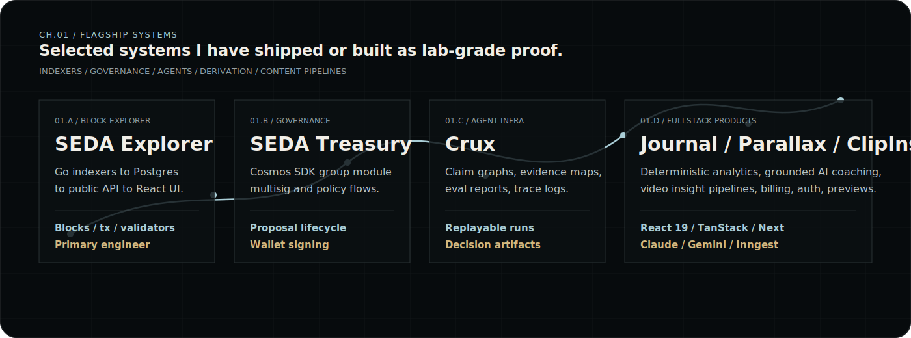
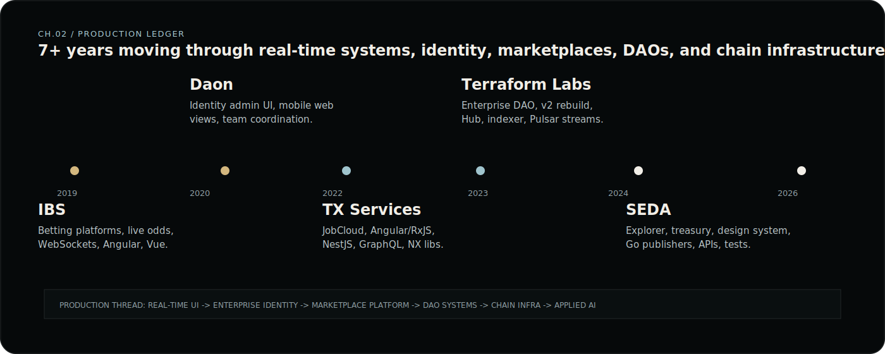
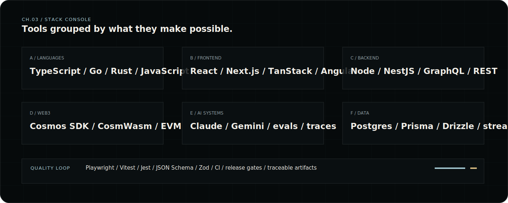

<p align="center">
  
</p>

<p align="center">
  <a href="https://nikola-cehic-portfolio.vercel.app"><strong>Portfolio</strong></a>
  &nbsp;/&nbsp;
  <a href="./assets/Nikola-Cehic-CV.pdf"><strong>CV.pdf</strong></a>
  &nbsp;/&nbsp;
  <a href="https://www.linkedin.com/in/nikola-cehic-60a50914a/"><strong>LinkedIn</strong></a>
  &nbsp;/&nbsp;
  <a href="mailto:nikola95cehic@gmail.com"><strong>Email</strong></a>
</p>

```text
SYSTEM_MAP / NODES=11 / LINKS=14 / STATUS=SIGNAL_LOCK
DOMAIN      Crypto infrastructure / applied AI / real-time product surfaces
STACK       Go / TypeScript / React / PostgreSQL / Cosmos SDK / LLM systems
MODE        Remote-first / async / senior IC / product-minded systems owner
```

## CH.00 / Signal

I build production software where the hard part is not just shipping the interface, but making the system behind it inspectable. The through-line across my work is **serious infrastructure with a product surface people can actually trust**: chain indexers, block explorers, DAO tools, evidence-backed AI agents, data-heavy dashboards, and design systems.

<p align="center">
  
</p>

## CH.01 / Flagship Systems

| System | What I owned | Proof |
| --- | --- | --- |
| [SEDA Explorer](https://www.seda.xyz/) | Go indexers, PostgreSQL models, public API, React explorer UI, search, filters, real-time chain inspection. | Primary engineer, built from the ground up. |
| SEDA Treasury | Cosmos SDK group-module app for treasury management, security groups, proposal lifecycle, wallet signing, policy config. | Production governance surface. |
| Enterprise DAO | DAO creation, voting, treasury, execution, frontend architecture, CosmWasm integration for token and NFT DAOs. | Senior frontend/fullstack lead work at Terraform Labs. |
| [Crux Harness](https://github.com/NikolaCehic/crux-harness) | Agent harness with claim graphs, evidence maps, contradictions, red-team memos, eval reports, trace logs, replay. | Auditable AI analysis runs, not black-box answers. |
| [Trade Journal](https://github.com/NikolaCehic/trading_journal) | Multi-exchange ingestion, deterministic position derivation, behavioral detectors, Claude coach, weekly grounded digest. | Full-stack solo product with AI grounded in user data. |

<p align="center">
  
</p>

## CH.02 / Production Ledger

**SEDA, Senior Fullstack Engineer, 2024 to now**<br />
Explorer, treasury governance, design system monorepo, backend APIs, Prisma/PostgreSQL, Go KV-store publishers for Cosmos SDK modules, Jest and Playwright coverage.

**Terraform Labs, Senior Fullstack Engineer, 2022 to 2024**<br />
Enterprise DAO, Enterprise DAO v2, Enterprise Hub, Enterprise Indexer and middleware work, CosmWasm integration, Apache Pulsar event streaming, production incident response.

**TX Services, Frontend Engineer, 2022**<br />
Angular, RxJS, NgRx, GraphQL, Apollo, NestJS middleware refactor, design-system collaboration, NX monorepo libraries, Jest testing patterns.

**Daon, Frontend Engineer, 2020 to 2022**<br />
Enterprise identity and biometrics admin UI, internal React tools, embedded mobile web views for iOS and Android, frontend team leadership and PR review.

**Intelligent Betting Software, Frontend Engineer, 2019 to 2020**<br />
Live betting interfaces, real-time odds, bet slips, market selection, crawler/service health tooling, AngularJS, Angular, Vue, WebSockets.

<p align="center">
  
</p>

## CH.03 / Lab Work

| Project | Signal |
| --- | --- |
| [Crux Studio](https://github.com/NikolaCehic/Crux-Studio) | Decision workbench for inspecting agent runs: memo, claims, evidence, uncertainty, diagnostics, replay, comparison, review actions. |
| [Crux Harness](https://github.com/NikolaCehic/crux-harness) | CLI and SDK layer for decision-quality agent analysis with schemas, eval council, run reports, marketplace packs, release verification. |
| [Parallax](https://github.com/NikolaCehic/Parallax) | Trading-thesis analysis agent with deterministic analytics, council review, veto gates, audit bundles, paper-trade boundaries. |
| [Trade Journal](https://github.com/NikolaCehic/trading_journal) | Trading journal that talks back: exchange import, derivation engine, 12 detectors, custom predicates, Claude coach, weekly digest. |
| [ClipInsight AI](https://github.com/NikolaCehic/clipinsightAI) | Video-to-content platform with Gemini analysis, platform-native generators, previews, Supabase, auth, Stripe, and demo mode. |
| [Portfolio](https://github.com/NikolaCehic/Nikola-Cehic-Portfolio) | The larger brand surface this README borrows from: dark systems map, chapter structure, senior proof density, polished React/Vite build. |

## CH.04 / Operating Principles

- **Own the system, not just the ticket.** I care about architecture, delivery, edge cases, production behavior, and whether the product solves the actual problem.
- **Make complex systems legible.** Blockchain, data, and AI products need interfaces that expose state, confidence, evidence, and failure modes.
- **Ship polished surfaces on serious infrastructure.** I move across UI, APIs, data models, indexers, and production debugging without losing user-facing detail.
- **Leave artifacts behind.** Schemas, traces, eval reports, run folders, review states, release gates, and tests make the next iteration safer.

<p align="center">
  <strong>Open to senior fullstack, Web3 product engineering, crypto infrastructure, and AI-native product roles.</strong>
  <br />
  <a href="mailto:nikola95cehic@gmail.com">Start a conversation</a>
  &nbsp;/&nbsp;
  <a href="https://nikola-cehic-portfolio.vercel.app">See the portfolio</a>
  &nbsp;/&nbsp;
  <a href="./assets/Nikola-Cehic-CV.pdf">Read the CV</a>
</p>
